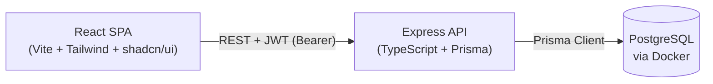

# Courier Service Application

A full-stack courier service application built with the **PERN** stack (PostgreSQL, Express, React, Node.js) and TypeScript. Clients can create accounts, create shipments, and track them in real time. Admins can manage all shipments and update their status.

## Architecture

```
Half-life/
├── backend/    # Express 5 + TypeScript + Prisma + PostgreSQL
└── frontend/   # Vite 8 + React 19 + Tailwind CSS v4 + shadcn/ui
```



## Prerequisites

| Tool | Version |
|------|---------|
| Node.js | 22 LTS ("Jod") |
| npm | 10+ |
| Docker Desktop / Docker Engine | Latest |

## Quick Start

### 1. Start the database

```bash
cd backend
docker compose up -d
```

### 2. Start the backend

```bash
cd backend
cp .env.example .env          # fill in JWT_SECRET at minimum
npm install
npx prisma migrate dev --name init
npm run seed                   # creates admin + demo user + shipments
npm run dev                    # listens on http://localhost:4000
```

### 3. Start the frontend

```bash
cd frontend
cp .env.example .env           # VITE_API_BASE_URL=http://localhost:4000/api
npm install --legacy-peer-deps
npm run dev                    # opens http://localhost:5173
```

## Default Credentials (after seed)

| Role | Email | Password |
|------|-------|----------|
| Admin | `admin@courier.local` | `Admin@1234` |
| User | `demo@courier.local` | `User@1234` |

These match `prisma/seed.ts` (also printed when you run `npm run seed`).

## API Reference

| Method | Path | Auth | Description |
|--------|------|------|-------------|
| POST | `/api/auth/register` | Public | Register a new user |
| POST | `/api/auth/login` | Public | Login and receive JWT |
| GET | `/api/auth/me` | Bearer | Get current user |
| GET | `/api/users/me` | Bearer | View profile |
| PUT | `/api/users/me` | Bearer | Update profile |
| POST | `/api/shipments` | Bearer | Create shipment |
| GET | `/api/shipments` | Bearer | List shipments (own/all) |
| GET | `/api/shipments/:id` | Bearer | Get shipment detail |
| PATCH | `/api/shipments/:id/status` | Admin | Update shipment status |
| GET | `/api/shipments/track/:trackingNumber` | Public | Public tracking lookup |

## Running Tests

```bash
# Backend (Jest + Supertest)
cd backend && npm test

# Frontend (Vitest + React Testing Library + MSW)
cd frontend && npm test

# With coverage
cd backend && npm test -- --coverage
cd frontend && npx vitest run --coverage
```

Both suites target **≥80% coverage** across statements, branches, functions, and lines.

## Tech Stack

### Backend
- **Runtime**: Node.js 22 LTS
- **Framework**: Express 5.2
- **Language**: TypeScript 6.0
- **ORM**: Prisma 6.x + PostgreSQL 16
- **Auth**: JWT (jsonwebtoken 9) + bcrypt 6
- **Validation**: Zod 4.4
- **Logging**: Pino 9 / pino-http 10
- **Testing**: Jest 30 + ts-jest + Supertest 7

### Frontend
- **Bundler**: Vite 8
- **Framework**: React 19
- **Language**: TypeScript 6.0
- **Styling**: Tailwind CSS v4 + shadcn/ui (new-york)
- **Routing**: React Router DOM 7
- **State**: TanStack React Query 5
- **Forms**: React Hook Form 7 + Zod 4
- **HTTP**: Axios 1.7
- **Testing**: Vitest 4.1 + React Testing Library 16 + MSW 2.14
